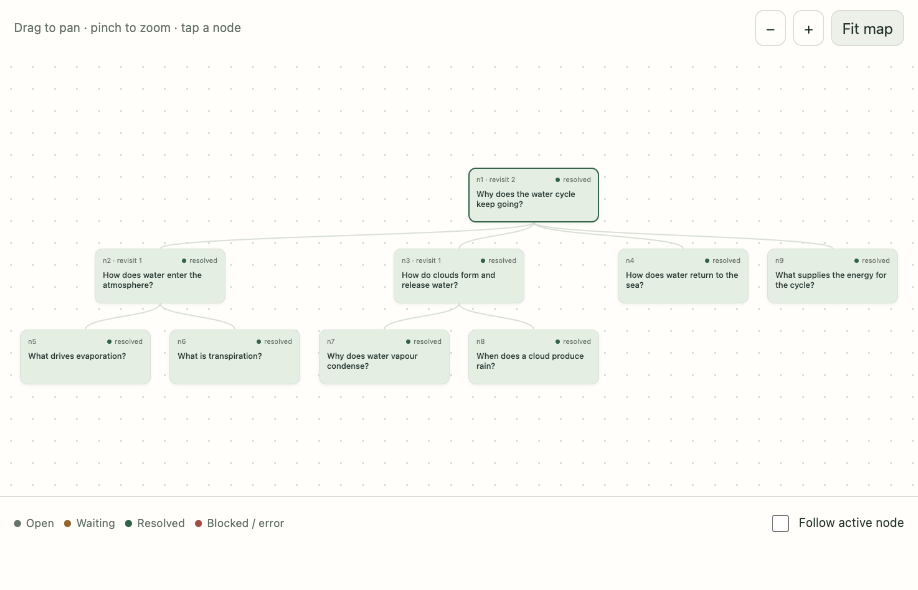

# Tangle

**Can a very small language model understand something by asking itself small questions?**

Tangle is a research toy for finding out. Give it a question or a brief. Instead of answering in one go, it grows a graph: each node is one small question, answered from one Wikipedia article by a tiny model that sees almost nothing else. The model never writes the answer. It only picks: which article, which section, which sentence. Code does the rest, and every sentence in the result is Wikipedia's own, cited to where it was read.

**Try it: [www.jkershaw.com/tangle](https://www.jkershaw.com/tangle/).** The simulation runs instantly with no download. Live mode runs a real model on your own GPU, in the browser, with nothing sent to any server.



## The idea

Large models answer in one long pass, and they need to be large to hold a whole problem in view at once. Tangle asks whether the *shape of the work* can stand in for size. If every model call sees one bounded question and a few paragraphs of evidence, a model with 600 million parameters is never asked to do anything it is bad at. The open question is whether the pieces add up, or whether errors compound at every step and the graph fills with confident nonsense.

Tangle is built to make that visible rather than hide it. Repeated questions, odd decompositions, branches that never resolve: those are the data. The harness records them before anyone is tempted to fix them.

## What we have found so far

After two days of measured runs (September 2026), three things are clear.

**It works when the answer is spread out.** Ask for a profile ("Tell me about Alan Turing and elaborate on the impact of his work") and the graph reads the article's lead, one section per child, and then the articles those sections mention, keeping only sentences about the subject. At 8B the Turing profile is seventeen paragraphs from twenty-two articles. Scored on how many rubric topics each profile touches, the graph beats both a single node and the model's own memory at every size from 1.7B up:

| brief set (topics) | model | graph | one node | memory alone |
|---|---|---|---|---|
| four profiles (35) | 8B | **27** | 13 | 20 |
| | 4B | **23** | 16 | 10 |
| | 1.7B | **26** | 15 | 15 |
| three briefs where memory is weak (30) | 8B | **27** | 16 | 17 |
| | 4B | **25** | 18 | 12 |
| | 1.7B | **24** | 18 | 5 |

The 1.7B model names five of thirty topics from memory and reads its way to twenty-four. Every sentence is Wikipedia's, in Wikipedia's order, cited to its section.

**It does not beat memory on questions the model already knows.** On short factual questions ("Why is the sky blue?") a 4B or larger model recites more from memory than any amount of reading adds. Those questions measure recall, not understanding, and the benchmark had to learn to avoid them.

**Small models pick well and write badly.** Shown a numbered list, a 1.7B model chooses the right sentence, section or article nearly every time. Asked to write anything, even a search term, every size drifts. So the design rule became: code prepares the choices, the model picks one, and the model is never asked to compose. Almost every fault found by reading the output turned out to be code's, and code is cheap to fix and test.

The full account is in [LEARNED.md](LEARNED.md).

## How it works

A **node** is one question. A run starts with one node, the seed, and grows children below it. The harness visits one node at a time, deepest first, and comes back to a parent once its children are settled.

A **visit** is a fixed sequence of small decisions, each a single model call with a single choice:

1. Code turns the question into a search term and searches Wikipedia. If several articles match, the model picks one from the titles.
2. Code reads the article's lead and numbers its sentences. The model picks the sentence that answers the question, or says none. That sentence, verbatim, is the **finding**, cited to the excerpt it came from. Up to three sentences can be kept.
3. If nothing answers, the model picks a section to read on into, or names a smaller question. A smaller question becomes a child node, with an empty context of its own.
4. When the children are settled, the parent's answer is what they found, with no further model call.

A **brief** (no question mark, or "tell me about…") takes a different shape: the lead, one child per section the model chooses, and under each child up to two more children opened on the things its sentences name, each reading the part of that article that is about the subject. The root's finding is the profile, paragraph by paragraph, in the article's order.

Two rules hold everything up.

- **The harness owns the graph.** The model only picks from things code prepared. Code validates every choice, refuses invented evidence, and bounds the graph: 40 nodes, 60 visits, depth 6, two lookups per visit.
- **Findings are not evidence.** A finding is what the model chose. Evidence is what was actually read: the article, the revision, the characters. A finding can be wrong; the evidence records what happened. "Resolved" is a decision, never a guarantee.

## What you'll see on the page

**Simulation** replays scripted responses so you can watch the mechanics without a model. Three scenarios take a minute each: a parent that asks again once its children answer, a source that is unavailable so one branch blocks, and a question that keeps re-asking itself until it hits the depth limit.

**Local LLM + Wiki** is the real thing. Pick a Qwen3 model from 0.6B to 8B, download it once, and the browser runs it on your GPU through [WebLLM](https://webllm.mlc.ai/). English Wikipedia is the only source, and you approve each lookup or allow them all. Type a question or a brief and press Run.

Either way, tap a node to see exactly what the model was shown and what it said. The whole run exports as JSON: every prompt, every output, every lookup, every finding, and which evidence each finding rests on.

## The frontier

Where it stands as of 19 September 2026 (walk-14 and the bridge). Kept current as the numbers move.

**Known to work.**
- A pick from a numbered list is reliable from 1.7B up, and every finding is supported by construction. No run has stated a fact its evidence did not hold.
- Profiles beat one node and memory at every size on every brief set tried (table above).
- Splitting a two-subject question in code beats one node at every size on the seeds no single article answers. Model-written sub-questions drift and rarely help.
- The same walk runs in Node with no browser against Ollama or LM Studio, and a parity test shows both runtimes grow the identical graph from the same seed, recording and picks. That extends the ladder to 14B and 32B, and Node is fast: the 1.7B suite in 12 seconds against a minute in the page.
- A bigger picker helps on briefs and not on questions. In Node the four profiles reach 25 / 27 / 30 of 35 topics at 8B / 14B / 32B, the best row yet; the question seeds stay between 15 and 17 of 23 from 1.7B to 32B while memory climbs.

**Known to fail.**
- Memory beats reading on memorised questions, and size does not change that: through Ollama the question seeds score about the same from 1.7B to 14B while memory climbs.
- 8B fills every hop slot and rejects a third of what it finds; 1.7B opens fewer hops and cites every one. Neither uses the forty-node budget. The topic rubric counts touches and cannot say whether a longer profile is better; a judge is missing.
- 0.6B says none to every sentence under a brief. It is below the floor for profiles.
- Section choice sets breadth: 4B stops after three sections, and a short parent heading is chosen and blocks. 14B says none more often than any smaller size, then asks a question, and a question child may re-read what its parent read.
- When a question hands down a narrower question, the parent's answer is what the child found, by code and with no pick (walk-14; before it the model was asked and its "none" ignored). Whether the narrower answer really answers the parent's question is not judged. The rubric cannot tell, and a judge is missing.
- A cited sentence can still be off the brief. A 1.7B Rosetta profile carried a paragraph about Jupiter's core because "mission" is a word of "Rosetta mission"; walk-13 requires the subject's own capitalised words. The topic rubric cannot see that fault, and the graph reads five times the tokens of one node; a judge and an equal-budget control are both missing.

**Next.** Roadmap milestone 5: read-only tools over files, with this repository as the first corpus, which tests whether the gains transfer beyond Wikipedia's ready-made sections and links. The milestones and their exit conditions are in [ROADMAP.md](ROADMAP.md).

Small models will decompose badly, repeat themselves, misread evidence and resolve too early. Keep the exports; that is the experiment.

## For developers

### The measuring stick

Live mode first ran on 17 September 2026, and the first day's failures reshaped the harness: 0.6B wrote its own evidence and answered a Dead Sea question with a cited finding about the Aral Sea; 1.7B read a two-sentence lead 79 times. The one-prompt visit that asked for five decisions at once was measured and replaced by the walk described above (PLAN.md, *The turn*).

[PLAN.md](PLAN.md) sets out three layers of checking: unit tests, fixture replays of real model outputs, and evals that run the model. Node evals re-run one ask at a time across the model ladder. A benchmark scores whole runs for facts stated, facts supported by a cited excerpt, and cost, against three controls: the same walk on one node, a one-node model that writes its own answer, and the model alone. Wikipedia is recorded and replayed so a harness change is the only variable. [PROGRESS.md](PROGRESS.md) holds the scoreboard, [evals/readings.md](evals/readings.md) says what each round meant, and [BRIEF.md](BRIEF.md) is the design brief the project is built to.

### In this repository

```
src/graph.js       the harness-owned graph: run creation, scheduler, validation, mutation
src/walk.js        the walk: one visit as a fixed sequence of picks, sequenced by code
src/asks.js        the asks: each pick as a prompt and a tiny JSON schema, in variants
src/episode.js     the earlier one-prompt visit, kept for the simulation and comparison
src/simulation.js  the scripted water-cycle scenarios and fixture evidence
src/wiki.js        the Wikipedia tool (HTTPS en.wikipedia.org only, timeout, byte cap)
src/webllm.js      device, storage and cache probes; the WebLLM engine adapter; model list
src/endpoint.js    the second model adapter: an OpenAI-compatible endpoint (Ollama, LM Studio)
src/scripted.js    a scripted first-choice model, for the runtime parity test
src/map.js         the graph map (layout, pan, zoom)
src/main.js        UI wiring
src/page.html      page template; the bundle is inlined at build time
build.js           esbuild bundle + inline -> docs/index.html (one self-contained file, ~6 MB)
test/              node --test suites, including ones that drive the built page
scripts/           lab.mjs drives the built page; node-lab.mjs runs the walk in Node; recording.mjs
                   is the Wikipedia recording; live-run.mjs and run.mjs record one run (page, Node);
                   eval.mjs runs the eval suites in either runtime; grade.js holds the graders;
                   summarise.js reads an export
evals/             eval cases, benchmark seeds with rubrics, the Wikipedia recording, results
experiments/       exported runs and notes, committed next to the code that produced them
docs/index.html    the built page, served by GitHub Pages
```

The whole app is one HTML file. Open `docs/index.html` from disk and the simulation works offline; live mode wants an HTTPS or localhost origin so the browser will cache model weights.

### Run it locally

Node 22 or later.

```
npm ci
npm test          # graph, walk, wiki and adapter tests, plus the built page in headless Chrome
npm run build     # rewrites docs/index.html
```

CI rebuilds the page on every push to `main` and refuses to deploy if the committed `docs/index.html` differs from a fresh build.

### Run an experiment

In the page, a script drives a headed Chrome so the export, a map screenshot and a notes file land in `experiments/` together:

```
python3 -m http.server 8765 -d docs --bind 127.0.0.1        # in one terminal

node scripts/live-run.mjs --mode live --model Qwen3-1.7B-q4f16_1-MLC \
  --seed "Why does the water cycle keep going?" \
  --out experiments/2026-09-17-qwen3-1.7b-water-cycle         # in another

node scripts/summarise.js experiments/2026-09-17-qwen3-1.7b-water-cycle.json
```

WebGPU is not available headless, so live mode opens a visible Chrome. Model weights stay in a profile at `~/.cache/tangle/chrome-profile`, so only the first run per model downloads. Use `127.0.0.1`, not `localhost`. The page's models are Qwen3 at 4-bit: 0.6B (~0.4 GB, runs on a recent phone), 1.7B (~1 GB), 4B (~2.5 GB) and 8B (~5 GB).

In Node, the same walk runs with no browser against any OpenAI-compatible server (Ollama, LM Studio, llama.cpp), which is how the ladder reaches 14B and 32B:

```
node scripts/run.mjs --seed "Why is the Dead Sea shrinking?" --model qwen3:8b \
  --out experiments/2026-09-19-qwen3-8b-dead-sea-node          # --endpoint http://127.0.0.1:11434/v1 by default

node scripts/eval.mjs runs --endpoint http://127.0.0.1:11434/v1 --model qwen3:14b --mode tangle
```

The page stays the lab and the single file; Node is an adapter behind the same two seams, the model and Wikipedia. The weights differ by quantisation between the page and a server, so a Node row is its own column rather than a rerun of the page's.

Each run writes an export (everything the model saw and said) and a notes file with the summary and space for observations. Commit them. The summariser flags what deserves a second look: repeated questions, lookups that found nothing, generations cut off mid-way.

## Lineage

This is the third iteration of the idea. The WebLLM adapter and Wikipedia tool descend from [Browser-agent](https://github.com/JKershaw/Browser-agent). The source bundle as originally delivered is preserved at the git tag `original-source`.

MIT licence. Wikipedia content remains attributed to its contributors under CC BY-SA 4.0; model weights are under their own licences.
